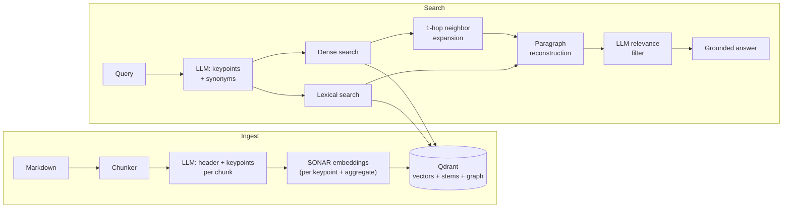

# Prism

**Hybrid RAG engine that decomposes queries into keypoints and retrieves across dense vectors, lexical stems, and a knowledge graph — in any of 200 languages.**

---

Classic RAG embeds your question as a single vector and hopes for the best. **Prism** takes the question apart first.

```
"can I check in with a dog, and is there parking nearby?"
        │
        ▼  LLM decomposition
["staying with a dog", "pets", "hotel parking", "car park"]
        │
        ▼  per-keypoint hybrid retrieval
dense vectors  +  strict lexical match  +  graph neighbors
        │
        ▼  LLM relevance filter
"Yes, pets up to 5 kg are allowed. Parking is available..."
```

Every keypoint gets its own dense search; in parallel, a strict AND-on-stems lexical search catches exact terminology that embeddings smear out; a 1-hop graph expansion pulls in the surrounding context of good hits. An LLM judge then drops anything that doesn't actually answer the question.

## Features

- **Keypoint decomposition** — documents *and* queries are broken into atomic key phrases by an LLM. Multi-intent questions stop being a single muddy vector.
- **Hybrid retrieval** — dense search (per-keypoint + aggregate vectors, adaptive percentile cutoff) fused with strict lexical search (Snowball stems + sentence-level proximity) and 1-hop neighbor expansion over a similarity graph.
- **Truly multilingual** — [SONAR](https://github.com/facebookresearch/SONAR) embeddings cover 200 languages in one vector space. Corpus language is auto-detected and propagated everywhere: embedder, prompts, stemmer. Queries in the wrong language get a polite localized refusal instead of garbage.
- **Full-context answers** — retrieved chunks are stitched back into their original markdown sections, so the answering LLM sees whole paragraphs, never isolated fragments.
- **LLM-in-the-loop precision** — a relevance judge filters every candidate paragraph; the final answer is grounded strictly in what survived.
- **Single storage backend** — everything (vectors, lexical payloads, graph) lives in [Qdrant](https://qdrant.tech/). No Elasticsearch, no separate graph DB.
- **Prompt-injection hardened** — user input is treated as data at every LLM boundary; injection attempts are detected and neutralized during query analysis.
- **Async-first, typed, tested** — `asyncio` end to end, Pydantic structured outputs, mypy strict, pytest suite.

## How it works



## Quickstart

### 1. Prerequisites

- Python **3.11+**
- Docker (for Qdrant)
- An OpenAI API key
- `libsndfile` (required by SONAR's fairseq2):
  ```bash
  # Debian/Ubuntu
  sudo apt install libsndfile1
  # macOS
  brew install libsndfile
  # Conda — must be inside the env, fairseq2 won't see the system copy
  conda install -c conda-forge libsndfile
  ```

### 2. Install

```bash
git clone https://github.com/vadimscher/prism-rag.git
cd prism-rag
pip install -e ".[sonar]"
```

> The `sonar` extra pulls in `torch` and `fairseq2` (~3 GB model downloaded on first use).
> Don't want SONAR? Skip the extra and plug in your own embedder — see
> [Bring your own embedder](#bring-your-own-embedder) for the contract it must follow.

### 3. Start Qdrant & configure

```bash
docker compose up -d qdrant
cp .env.example .env   # put your OPENAI_API_KEY here
```

### 4. Run

```python
import asyncio

from qdrant_client import AsyncQdrantClient
from prism import LLMClient, Prism, PrismGraph, QdrantBackend, SonarEmbedder


async def main() -> None:
    qdrant = QdrantBackend(
        AsyncQdrantClient(url="http://localhost:6333"),
        collection_name="my_kb",
    )
    graph = await PrismGraph.create(qdrant, SonarEmbedder(), recreate=True)
    prism = Prism(graph, LLMClient())

    # Ingest any markdown — language is auto-detected on first ingest
    await prism.ingest(open("docs/hotel_handbook.md", encoding="utf-8").read())

    result = await prism.answer("can I bring a dog?")
    print(result.answer)
    # Yes, pets up to 5 kg are allowed.


asyncio.run(main())
```

## Demo

The repo ships an end-to-end demo over a tiny **Russian** hotel corpus — the multilingual
pipeline in action:

```bash
python demo/aiso_hotel_demo.py         # script
jupyter lab demo/aiso_hotel_demo.ipynb # annotated notebook
```

Real output (the LLM decomposes each query into keypoints, hybrid retrieval finds the
section, the relevance judge keeps only what answers the question):

```
QUERY: можно ли с собакой?                 # "can I bring a dog?"
keypoints: ['проживание с собакой', 'домашние животные', 'размещение с питомцами', ...]
  [1] Проживание с домашними животными допускается. Животное должно быть до 5 кг.

QUERY: есть ли тренажёрный зал?            # "is there a gym?"
keypoints: ['тренажёрный зал', 'спортивный зал', 'фитнес-зал', ...]
  [1] Мини-фитнес-зал

QUERY: во сколько заезд и выезд?           # "what are check-in/check-out times?"
keypoints: ['время заезда', 'время выезда', 'время check-in', 'время check-out', ...]
  [1] Время заезда: с 14:00 Время выезда: до 12:00
```

A query in the wrong language gets a polite localized refusal instead of garbage:

```
QUERY: can I bring my dog?
answer: The corpus is available in Русский only. Please ask your question in this language.
note:   language mismatch
```

## Usage

Prism gives you two answer modes: `search()` for raw chunks, `answer()` for a ready reply.

### Mode 1 — chunks: `search()`

Returns the raw retrieval result, no generation on top — for when you have your own
generation layer or need citations:

```python
res = await prism.search("what are the check-in and check-out times?")
res.keypoints   # ['check-in time', 'check-out time', 'arrival hours', ...]
res.paragraphs  # ['Check-in: from 2:00 pm. Check-out: until 12:00 pm.']
res.nodes       # matched graph nodes (for tracing / citations)
```

### Mode 2 — answer: `answer()`

Adds one LLM call on top of `search()` that answers the question *directly* — with the
qualifying details (numbers, times, limits), not a retelling of everything retrieved:

```python
ans = await prism.answer("can I bring a dog?")
ans.answer         # the grounded answer
ans.search         # underlying SearchResult for citations
ans.note           # why the answer is empty, when it is (see below)
```

### Graceful degradation, not exceptions

The pipeline short-circuits cheaply and explains itself via `note`:

| Input | `note` |
|---|---|
| `""` | `empty query` — zero LLM calls |
| `"hi there"` | `query is not an information request` — one cheap LLM call, no retrieval |
| Query in a language other than the corpus | `language mismatch` — localized refusal in `answer` |
| Question the corpus can't answer | `no relevant fragments retrieved` |

### Bring your own embedder

`SonarEmbedder` is the default, not a requirement. `PrismGraph` accepts any implementation
of the `prism.embeddings.Embedder` ABC — but Prism relies on a specific contract, so your
embedder must match it exactly:

```python
import numpy as np
from prism.embeddings import Embedder


class MyEmbedder(Embedder):
    @property
    def dim(self) -> int:
        return 1536  # your vector dimensionality

    async def embed(self, texts: list[str]) -> np.ndarray:
        # MUST return a float32 array of shape (len(texts), dim)
        # MUST be L2-normalized (unit vectors)
        # MUST return an empty (0, dim) array for an empty input list
        ...
```

Normalization is load-bearing: the whole pipeline treats cosine similarity as a plain dot
product, so unnormalized vectors silently break every threshold.

Any `dim` works (512, 768, 1536, ...) — `PrismGraph` propagates `embedder.dim` into
`QdrantBackend` automatically. An explicitly set `vector_size` that disagrees with the
embedder, or an existing collection built with a different dimension, fails fast with a
clear `ValueError` (changing the embedder always means reindexing).

Optional: if your embedder exposes a `source_lang` attribute (like `SonarEmbedder`), Prism
propagates the detected corpus language into it; without it, everything else still works.

### Bring your own LLM

Same story for the LLM layer — two levels of customization:

**Level 1 — any OpenAI-compatible API.** The bundled `LLMClient` accepts a pre-configured
SDK client, so vLLM, Ollama, OpenRouter, or a proxy all work out of the box:

```python
from openai import AsyncOpenAI
from prism import LLMClient

llm = LLMClient(
    client=AsyncOpenAI(base_url="http://localhost:11434/v1", api_key="ollama"),
    fast_model="llama3.1:8b",
    strong_model="llama3.1:70b",
)
```

**Level 2 — fully custom client.** `Prism` accepts any object satisfying the
`prism.LLMProvider` protocol (structural typing — no inheritance required):

```python
from pydantic import BaseModel


class MyLLM:
    async def complete_structured[T: BaseModel](
        self, system: str, user: str, schema: type[T], *, tier: str = "fast"
    ) -> T:
        """MUST return a validated instance of `schema` (or raise)."""
        ...

    async def complete_text(
        self, system: str, user: str, *, tier: str = "fast"
    ) -> str:
        """MUST return the raw text response."""
        ...
```

`tier` declares intent: `fast` = high-volume calls (extraction, query analysis, filtering),
`strong` = heavy one-offs (summaries, answers); mapping both to one model is fine. Retries
are your responsibility — the pipeline treats every call as a single attempt.

### Configuration

All knobs work via constructor arguments or environment variables:

| Variable | Default | Purpose |
|---|---|---|
| `OPENAI_API_KEY` | — | OpenAI auth (required) |
| `QDRANT_URL` | `http://localhost:6333` | Qdrant endpoint |
| `PRISM_LLM_FAST_MODEL` | `gpt-4o-mini` | High-volume calls: extraction, filtering |
| `PRISM_LLM_STRONG_MODEL` | `gpt-4o` | Heavy calls: summarization, answers |
| `PRISM_SONAR_DEVICE` | auto (`cuda` if available) | Force `cpu` / `cuda` for SONAR |

## Project layout

```
src/prism/
├── core/          # Prism orchestrator, graph, chunker
├── embeddings/    # Embedder ABC + SONAR implementation
├── llm/           # OpenAI client (fast/strong tiers), prompts
├── schemas/       # Pydantic structured-output models
├── storage/       # Qdrant backend (vectors + lexical anchors)
└── utils/         # language detection, stemming, text utils
```

## Development

```bash
pip install -e ".[sonar,dev]"
pytest                    # fast unit tests
pytest -m integration     # real SONAR inference (downloads the model)
ruff check src tests
mypy src
```

## License

[MIT](LICENSE)
